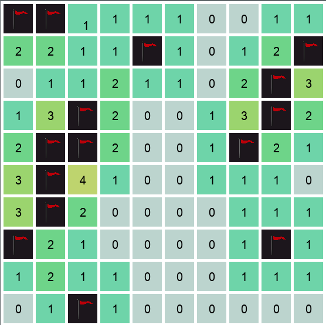

# minesweeper-sdl

minesweeper made in sdl. It is unfinished and im working on [something else](https://github.com/mativ123/obel2d) at the moment, but im most likely going to come back to it.

## on the docket:
* dying when you click a mine
* winning when you clear all mines
* recursively open empty tiles
* UI for selecting dimensions
* presets for dimensions

## screenshots:

## installation
you will have to compile it youself. I use g++ on arch but, you will have to use visual studio or minGW on windows. I only used SDL2, SDL_ttf and SDL2_image so it should be doable.
